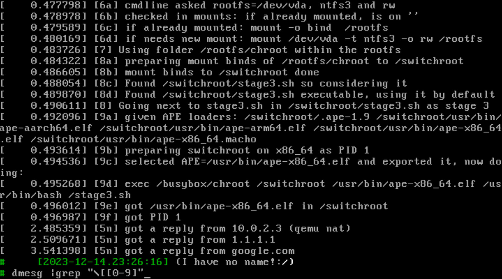
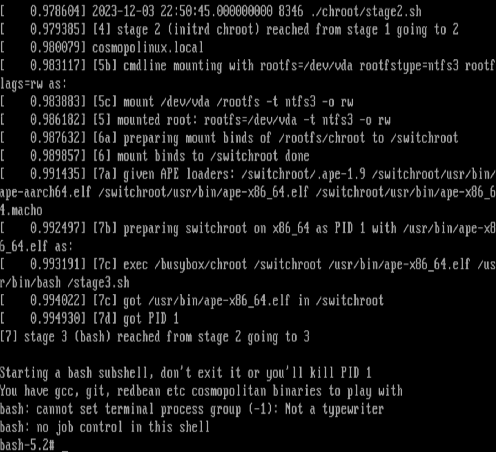

# ☪☮$m✡✝🍏linux, in pictures

☪☮$m✡✝🍏linux (henceforth referred to as "Cosmopolinux") boots a linux kernel in qemu and starts a cosmopolitan bash in less than half a second:


The full boot sequence can be seen in this asciinema recording of the qemu console:


When recording qemu GTK output with OBS studio, it takes a little longer to get bash, but Cosmopolinux still gets you there in less than half a second:


If Cosmopolinux looks like a quaint minimalistic retrocomputing Linux CLI, ["mission accomplished"](https://en.wikipedia.org/wiki/Mission_Accomplished): it's my 2023 Christmas project, to show it's possible to [☪☮e✡i$✝ peacefully with other OSes](https://en.wikipedia.org/wiki/Coexist) and move beyond the sterile "religious" flamewars about Windows and Linux (I love them both!)

Cosmopolinux will get you the simplest possible command line experience, as fast as possible yet with a quite a few modern extras such as [a sqlite shell history](https://github.com/csdvrx/bash-timestamping-sqlite/) - and of course, Qemu and a linux kernel v6.2.

# TLDR; love the pics, love the concept, I want to test it, how can I quickly do that?

Download the 4 following files:

 - kernel.bzImage
 - initrd.cpio.gz
 - cosmopolinux.ntfs3.bz2
 - stage0-qemu.sh

On Linux, install qemu, decompress the compressed disk-image with `bunzip2 cosmopolinux.ntfs3.bz2` then run `sh -c ./stage0-qemu.sh`

You can then connect normally:

 - by VNC (on port 5900 of localhost)
 - in the future, through [a http ttyd](https://github.com/tsl0922/ttyd) (TODO: compile ttyd with cosmopolitan, [prepare some mDNS candy](https://github.com/csdvrx/PerlPleBean/blob/main/experiments/bonjour-server.pl))

If you find something you like in cosmopolinux, you can extract and use the binaries you find within cosmopolinux on your OS: since they are cosmopolitan binaries (TODO: except busybox, can't replace it by sbase-box: missing mount), they will work without requiring virtualization or emulation.

Stage 1 sheds some consoles in the early stages, so if you want to see what's happening behind the curtains of cosmopolinux init scripts, you can also connect to:

 - though stdio, automatically (if running ./stage0-qemu.sh from a terminal),
 - through qemu emulated serial port: use `picocom -b 38400 /dev/pts/X` (where X is the integer given by ./stage0-qemu.sh)
 - through the network, use `telnet localhost 7000` (to have that on your LAN use port forwarding or configure your routing and IP for tap0)

In any case, you should immediately get a commandline, without having to bother with pesky little things and practical annoyances like passwords :)

# I did that, but cosmopolinux is not like the pictures!

If you want to automatically get a graphical window like in the qemu-gtk.mp4 example, edit stage0-qemu.sh to use a different -view option, or to automatically start a VNC client for you.

If you use one of the early stage consoles in a terminal, you will see the filesystem tree as it is *AFTER* the first chroot but *BEFORE* the switchroot which exposes all the interesting cosmopolitan binaries that make cosmopolinux.

This is by design for now (TODO: on stage 3, PID 1 should close the existing consoles and open new ones, try to have that bash in tmux to share the session)

You can still get cosmopolitan bash with either `chroot /switchroot/ /.ape-1.9 /usr/bin/bash` or by running `/initrd/join-stage3.sh` that essentially does the same thing after fixing the PATH to workround a bug in NTFS3 symlinks that makes busybox otherwise unusable.

# It's like the pictures, but what is cosmopolinux?

Cosmopolinux is a 3-in-1:

 - a distribution of a few curated and configured [Cosmopolitan polyglot binaries](https://github.com/jart/cosmopolitan) from [cosmo.zip and a few other places](https://cosmo.zip/) (TODO: include more, and collect them automatically from a Makefile)
 - scripts to be able to boot this distribution (baremetal or virtualized within qemu) thanks to the custom staged init scripts (TODO: make sure stage1 and stage2 work like the old stage1and2 used for baremetal; add scripts to create UKIs for baremetal use)
 - a slightly optimized static linux kernel, with backported patches and a .config file so you can tweak it

Cosmopolitan binaries are polyglot static binaries made to run on every OS without using virtualization or containers thanks to libc work.

You want to run cosmpolitan binaries directly when you can, but sometimes you want to orchestrate a few cosmopolitan binaries or run them baremetal, and that's when Cosmopolinux helps:

 - Cosmopolinux is designed around cosmopolitan, like Alpine or Void are designed around muslc, so you can expect a better default experience with cosmopolitan binaries!
-  Cosmopolinux is also *FAR* much simpler than any other Linux distribution, so you can focus on the cosmopolitan binaries you want to run: the init will not get in your way when you only have one simple job to do!
 - Cosmopolinux is centered about cosmopolitan binaries, but comes with a Linux kernel as an option to run these binaries, and an optimized qemu script (stage 0), so it will not just "work everywhere" but to also try to provide a "great" experience *anywhere* qemu and cosmopolitan binaries can work!
 - Cosmopolinux is a much a simpler alternative to anything, even docker, with a codebase as small as possible (a few scripts) to be easily understandable, fixable, auditable and therefore more reliable: complexity is where bugs hide! If all you have is 3 stages of init scripts + terminals to monitor a running system, bugs can't hide for very long!

You get to decide which stage to start from is best suited for your usecase, because Cosmopolinux is made to be flexible: whether you A) use qemu for a consistent experience, B) run the kernel and initrd stages baremetal for maximized performance, or C) just extract and run the binaries, Cosmopolinux should aways work. (TODO: try to integrate superconfigure to make good on that final promise)

# What are the 3 stages?

The 3 stages are just arbitrary boundaries:

 - stage 0 is not really a stage, but a starting point: it's a script to help when booting, either baremetal (TODO: a script to make a UKI and ISO image) or through emulators like qemu (TODO: support more emulators like vmware, virtualbox, parallels)
 - stage 1 is when the constraints are the highest (ex: no /usr no dev, actually no filesystem is expected to be available outside initrd as the kernel may just have booted, and everything is in 1 folder, to coexist with a native OS)
 - stage 2 is when some expectations are met (ex: having the usual filesystems mounted and ready in their usual spot like /dev and /proc, thanks to switchroot; being root; being able to debug on some consoles) but not all (ex: not using /usr, since that's were cosmo fat binaries go)
 - stage 3 is when most expectations are met (ex: has /usr, has /dev, as /proc...) and all constraints are removed since everything should now be a cosmopolitan binary! (TODO: except busybox, to be replaced by sbase-box ASAP)

You could start from stage 3 directly: this would be the case if you just want a comfortable terminal experience and can meet most of the stage 3 script expectations.

On the other end of the spectrum, you can run everything through qemu starting at stage 0: it's just heavier: the more staging steps you require, the more assets (and computation) you need. You can get more speed by staying native as long as possible, and avoiding unnecessary steps, but this may cost you flexibility.

# Why so many stages?

Instead of trying to make everything fit into one box, different boxes were made.

As said in freedesktop, ["The duty of the minimal boot system that consisted of /bin, /sbin and /lib on traditional Unix, has been taken over by the initramfs of modern Linux. An initramfs that supports mounting /usr on top of / before it starts 'init', makes all existing setups work properly"](https://www.freedesktop.org/wiki/Software/systemd/separate-usr-is-broken/): here, stage 1 and 2 of the initramfs essentially do that, so that stage 3 can be more like an existing setup: stage 1 prepares the mounts in initrd for stage 2, which while still in initrd prepare the mounts for the actual NTFS partition.

Stage 3 can then proceed as usual, but I believe it will be easier to design different stage 2 scripts covering different sets of expectations (ex: when running on Windows 11 with WSL2...) that trying to fit everything into stage 3.

You may not always need 3 stages, but they offer nice boundaries, so everything is being moved to these 3 stages to better divide responsabilities:

 - the old stage1and2.sh should be replaced by parts inside stage1 and stage2 when work baremetal with 1 partition and no initrd
 - there should be a stage 2 script to allow starting from within a local folder on linux, then access essential filesystems (/dev /proc /sys/) with bind mounts, chroot, or with a better isolation thanks to namespaces (TODO: write a PoC script to show how docker can be replaced)
 - the configuration file used by bash in stage 3 (.bashrc etc) should be move to the zip part of the APE

# What does cosmopolinux achieve?

Cosmopolinux is how I avoid bothering with full distributions or containers for "simple" tasks that only need one executable: I think running single executables is at the same time "faster", "lighter" and "easier" to run than most alternatives.

For you, it may be a distribution of free software tools for Windows (or MacOS), or maybe a "small" distribution of "important" Linux programs. Or maybe it's a way to experience the dirty details of emulation? Or maybe learn about linux "fundamentals" through qemu without risks to your running system?

Actually, that's what it is for me too, but it's also a simple folder I can copy to the Windows partition (which I sometimes boot to), or the Linux partition as a "rescue" system (because I love messing with my distribution).

# Why all the "quotes"?

Because all these terms are subjective: what's simple, faster, lighter, easier, small (etc.) is just a matter of preferences.

Maybe you prefer kubernetes, or docker, or just systemd-nspawn? After all, they respectively provide self-healing, isolation, and easy access to scalability so you have good reasons to like them!

Personally, I believe 'Simplicity is the ultimate sophistication', and I prefer the smallest amount of complexity I can get away with to accomplish the task:

- I want to be able to remove the Linux kernel if I'm using Windows with WSL or Linux baremetal: in these cases, running single executables can be better than the alternatives.
- Yet for other tasks, I want to have a kernel around, and Cosmopolinux is primarly made to match my subjective preferences, including "flexibility".

# Why is there Linux in Cosmopolinux for "flexibility"?

Cosmopolitan binaries are great: the idea for Cosmopolinux started as a distribution of binaries made to work nicely with other and run well, based on the [cosmo.zip repository](https://cosmo.zip/pub/cosmos/bin/).

However, using cosmopolitan binaries still requires booting: it's taken care of when you already have an OS, but sometimes you have nothing to boot on to run your cosmopolitan binaries on, for example if you're installing on a new computer or doing some recovery.

So Cosmopolinux adds a kernel with the simplest possible initrd approach to use this collection of cosmopolitan binaries living in just 1 folder. You could bake these binaries inside the initrd, or put them inside a NTFS partition (or any other disk image), it shouldn't change anything.

But you can use this kernel only *WHEN NEEDED*. It's practical: booting baremetal benefits from having a kernel, as cosmopolitan baremetal doesn't have a lot of drivers yet (ex: no networking).

Since Cosmpolinux chosen kernel is a Linux kernel, it includes scripts to initialize everything the binaries running on a Linux kernel expects.

If Cosmopolinux didn't include a Linux kernel, when running on Linux it would just be like docker: a few namespaces here, a few cgroups there, then call it a day.

With a Linux kernel: you gain more flexibility, and with qemu you gain more reach and consistency, as you can run qemu on many hosts architectures while still defining the peripherals to be exactly what you want.

But again, using a kernel is *only an option*:

 - Cosmopolinux can be imaged into on a physical partition to run baremetal thanks to this kernel
 - but it can also be deployed to a single folder on an actual OS and both will coexist peacefully
 - and as explained before, you can also extract from Cosmopolinux the actual binaries you like to run them normally inside whatever actual OS you use.

There's one I would like to focus on: using Cosmopolinux as a development platform for cosmopolitan, thanks to the consistency and reproducibility of running bash and the C compiler on a known kernel, with known peripherals and a simple filesystem: we could use [superconfigure to create the binaries](https://github.com/ahgamut/superconfigure) but also try to have reproducible builds!

# Isn't it slow and wasteful to run a full kernel?

I think running cosmopolitan executables with a full Linux adds some waste, which may not be desirable in most cases, but if offers flexibility, so the only question is whether the tradeoffs are acceptable: if I can get to bash or vim in less than 1 second, it's "fast enough" for me. Here, it takes less than half a second, so I think it doesn't add limitations.

I can remove the stage 1 and stage 2 to directly use cosmopolitan bash (or vim...) whenever I have an actual OS running, and then it'd much faster too, but there's no need to chose between both: you can only use the extra kernel when you need it.

After having optimized Cosmopolinux boot, you can default to using the Linux kernel even if you almost never need it: looks at the screenshots on top, where bash gets PID 1 in less than half a second, and gets network interfaces in less than 4 seconds (about 50% of that seems due to qemu networking stack delays)

It previous versions, Cosmopolinux could a bit more than half a second, but a bit less than 1 second (about 50% of that time was wasted on e1000 initialization) which wasn't very "fast":


# Define "fast" and "slow"

It depends on your reference point, but whenever sometimes takes almost half of the time budget, I think it's slow.

Going back to this old version, the 0.8 to 0.9 seconds it took to boot the linux kernel could have been considered "fast", but then the e1000 network initialization is "slow" as it's the limiting factor:

```
[    0.402704] tun: Universal TUN/TAP device driver, 1.6
[    0.411114] e1000: Intel(R) PRO/1000 Network Driver
[    0.411115] e1000: Copyright (c) 1999-2006 Intel Corporation.
[    0.800914] e1000 0000:00:04.0 eth1: (PCI:33MHz:32-bit) 52:54:01:cd:33:c9
[    0.800920] e1000 0000:00:04.0 eth1: Intel(R) PRO/1000 Network Connection
```

You can see nothing happens between 0.42 and 0.8 seconds. I call that "slow" at this scale, where the reference point is the time it takes for the kernel to boot in qemu: it's 800 ms, where 400 ms are always wasted, even when you will not use the networking options.

Of course, these 400 ms are dwarfed by the time it takes for qemu network to be reliable: about another 3000 ms, so another order of magnitude! However, you can decide to run tasks *after* 4s if you need networking, or *immediately* if you don't care about networking but care about speed.

I've tried to trace the cause of these delays, I'm not done yet, but for e1000 it seem to be due to the "slow" autonegociation so I've changed the default qemu configuration to do without e1000 (but the e1000 driver is still present in the kernel, to try to support alternative uses of Cosmopolinux: edit the stage0-qemu.sh if you want to enable it again)

Now it's possible to get PID 1 (bash, or vim or anything you like) usually in less than half a second in the tests I ran on my laptop (<450ms +- 50ms), and to get network connectivity in less than 3 seconds (2.5s, with less variance)

# A personal dab at the time it takes to get network connectivity

We can get network connectivity in less than 3 seconds. Maybe it's considered to be a "normal delay", but I *absolutely HATE that long delay*: it's inacceptable to take several seconds to get the network ready after bothering to use fixed IPs to save the time it'd takes to do DHCP requests!

I don't understand what I'm doing wrong: the problem seems to be on qemu side, so I'm trying to get some PoC networking within the first second of the boot, regardless of what it takes: currently, I'm even considering exotic options like using the parallel port, or PPP and SLIP on the serial ports as they get initialized very quickly.

In stage0-qemu, I'm only using the first 2 serial ports (ttyS0 and ttyS1), which leaves 2 of them free in the default configuration of 4 serial ports.  I can't figure out some kind of multiplexing, the 2 leftover ports could be bonded into 1 interface for more performance, or could be used separately for input and output (then would it be a parallel serial port? lol!)

Ideally, networking will be done by something not that could also easily be added to Cosmopolitan, to "keep working" even when the cosmopolitan binaries are extracted from Cosmopolinux and run baremetal, as it would support and encourage more alternative uses.

[Running vim baremetal is fun](https://raymii.org/s/blog/Bare_Metal_Boot_to_Vi.html), but doing the same thing with redbean and TTFB of 1 second or less would be even better!

# What could be other alternative uses?

To look other possible alternative uses in the future, let's look again at how the initialization is done in 3 stages:

 - stage 0 is when you need to run baremetal or in emulation: you need to boot (MBR, UEFI) a kernel (Linux)
 - stage 1 is busybox based, when booting from a kernel (either baremetal or through qemu like virtualization)
 - stage 2 is also busybox based for now, and is used when some expectations are met
 - stage 3 is purely bash based, not because bash is better than zsh (even if I sometimes believe that!) but because bash is older and more common (some patters are called "bashism" for a reason!)

This gives me ideas: a [polyglot script approach](https://github.com/llamasoft/polyshell) in stage 1 or 2 could be used to meet different expections within PowerShell: then Cosmopolinux could replace msys2 on Windows without having to use WSL2 or using qemu.

This would be helpful light hardware, like the Lenovo Fold, even if it's [already possible to directly run cosmopolitan bash from the Windows Terminal](https://github.com/jart/cosmopolitan/issues/923) - but it could be made easier and nicer, by setting PWD from %cd% and doing anything else the other binaries may need.

Speaking of WSL2, I wonder if cosmopolinux could become a WSL2 distribution that would live natively on the NTFS drive? It may require extra tweaks, as Hyper-V seems to require VHDX files.

It would be nice if a Cosmopolinux that would live on C:\ could tolerate Bitlocker encryption, even when booting from a UKI: then the same Cosmopolinux folder could be used by WSL2 when booting Windows, and by the baremetal Linux when booting from a UKI!

NTFS+Bitlocker would be nice, however BRTFS (winbtrfs!) or ZFS support (openzfs!) would be even better: I'd like to eventually gain the flexibility of filesystem independance by supporting filesystems newer than NTFS while still having native support on many OS, but I also to still reliably (and quickly) end up in bash (or whatever), regardless of where yo u start or from which OS.

# Why NTFS? Can I remove NTFS?

NTFS was chosen because the #1 goal is to have the distribution "live naturally" within one folder inside the main C:\ drive on a PC running Windows.

The modern in-kernel NTFS3 support (not to be confused with ntfs-3g) allows POSIX attributes like permissions, users, groups so it's all transparent to the Linux kernel if using it in stage 1.

There's support for HFS, but it isn't as good yet - also, NTFS specifications seem more stable and frozen.

You are not *forced* to use NTFS: if you prefer say XFS over NTFS, just put the cosmopolitan binaries in a matching diskimage.

# Can I remove bash? What else can I remove?

Yes, bash is what stage 2 starts in stage 3 if there's no /init, but you can pack a different binary than bash, and name it /init or pass the init=/yourbinary to the commandline. A good choice would be redbean if you can tolerate the 3 seconds it takes for the network to be ready.

You can also remove stage 1 if you can relax the constraints enough for stage 2, for example if booting a Linux kernel directly to a partition, but then you won't have everything fitting in one folder.

I'd suggest keeping stage 1 and the initrd approach: just specify the cosmopolitan binary you want to run as root with the kernel cmdline parameter with "init=/your_binary"

# Why am I root?

At the moment, I believe users (UID/GID etc) are a bad tool for isolation, and not a good enough protection: if you are running cosmopolinux, you are already the equivalent of root on what's running cosmopolinux. If you are using qemu, you can't prevent the host kernel from checking what's running in the VM.

So why make it a security theater and have you type a password?

For now, if you really want users, nothing prevents you from adding entries to /etc/password /etc/groups /etc/shadow, starting daemons under the specific UID/GID, or changing file permissions: NTFS3 supports that.

But if you really want to keep 2 things isolated, you should start 2 different cosmopolinux. If you want to make them communicate, add networking.

When better protections like IOMMU, namespacing, pledging etc are added, this recommendation will softened as we can follow a "defense in depth" approach, but for now isolation seems to be the only real way to add security.

# Why is everything is just 1 folder?

One folder will help end-users remove the distribution if they don't like it, "pass it around" as one archive, and coexist with existing OS when running baremetal.

A single folder will also facilitate maintenance (ex: imaging).

It's not without drawbacks: having everything within one folder is also more challenging, for example because boot-time automounts can't be used (ex: for /dev) and some expectations can't easily be met (ex: just having a /dev or a /proc folder on the root filesystem requires using an initrd) without bringing in much more complexity.

Having to use this single folder forced me to write an init, which forced me learn how things work, and how it will be possible to have everything operate with C binaries without passing the buck to systemd.

# Why not systemd?

System-D is extremely well thought of, intuitive and well engineered. It's a pleasure to systemd on an actual computer, but this means system-D also hides away some complexities that I wanted to see and mitigate.

This small distribution is not made to replace existing distributions or OS (yet!), but to integrate better within Windows, Macs and Linux, to use cosmopolitan binaries ("stage 3") and maybe to help make (compile) them without adding too many requirements.

As nice as systemd is, it's also highly specific to Linux: unless Apple and Microsoft also adopt systemd, stage 3 is likely to remain in bash or some kind of script.

On the positive side, having scripts will also encourage users hacking them and adapting them to their needs!

I'd still love to use systemd somewhere, to have transitive dependancies, a faster asynchronous boot and a better debugging system than `echo something > /dev/kmsg`. Systemd also has some genius-level additions like timers (I hate cron with a passion!) or [systemd-bsod QR codes to complement error messages with links to a wiki, even if this was much derided as having a Microsoft employee add BSOD to Linux](https://www.phoronix.com/news/systemd-255-rc1) - that's much *MUCH* better than kmsg.

Also, systemd would provide a more "usual" interface to people who may not be familiar with shell scripting, busybox, or low level linux stuff and its intricacies: I had to learn way too much about rdinit, dev and its automount, or busybox needing a /dev/null to get Cosmopolinux working how I wanted.

I believe stage 2 would be the ideal place to have systemd, since the assumptions are relaxed compared to stage 1.

In stage 1, systemd main disadvantage would be its complexity: each new release comes with tens of pages of new options and documentation. The default behavior might changed in uncontrolled ways, while a small stage 1 busybox scripts will not do more in the future than what's directly visible inside it.

# Why not use busybox everywhere?

The goal is to play with cosmopolitan binaries. Right now, a cosmopolitan binary of busybox is very challenging due to how busybox configure system works.

If it's possible to have a cosmopolitan busybox doing everything, it will be great for stage 1!

If not, things can stay as is, with stage 2 being slowly split away into different sets of expectations (ex: stage 2 for when the host is Windows, stage 2 with just cosmpolitan binaries, etc) while trying to use alternative to busybox, or C binaries.

# Why use busybox at all?

The initrd was written in shellscript using busybox to better learn how the Linux boot sequence works, and to quickly check whether it could operate within the constrains of just 1 folder on a NTFS volume.

Eventually, everything may be replaced by cosmopolitan binaries, but for now, the separation between the initrd (stage 1 + stage2: busybox) and the normal mounted NTFS filesystem (stage 3: cosmopolitan) offer nice "natural borders" and specialization between the 2 extremes.

Going to a pure cosmopolitan experience will be easier to do progressively if some interfaces are defined:
 - in stage 1, busybox has all the tools required to start and interface with a Linux kernel, even in strage situations (ex: encrypted root filesystem, everything in 1 folder, unusual filesystems)
 - in stage 2, the Linux system is more "conventional": it has the usual /dev /proc /sys:
 - in stage 3, the user-facing binaries can be well-polished cosmopolitan binaries that may be used separately from cosmopolinux for example after getting "tried" within the distribution.

There could be different stage 1 and 2 depending on the OS or the abstraction, but for a stage 3 it shouln't matter as long as the stdio interfaces are present.

# Why is it written in shell script?

Writing in shell script is a very questionable choice: it's extremely fragile, and susceptible to small typo errors.

Also, shell scripting and piping logic can be complicated and hard to read if you are not used to it.

If you need convincing, try to quickly eyeball compare this logic and predict what will be printed:
 - `echo 1 && false || echo 2 && echo 3 && false || echo 4`
 - `echo 1 || echo 2 && echo 3 && false || echo 4 `

I've tried to minimize complex constructs like these, and to only have the logical "OR" in the end as negations, like `echo "1a" && step_which_may_fail && echo "1a success" || echo "1a failure"` (I'm using numbers and letters to show the expected ordering) but it's not ideal: the shell scripts could be written much more defensively.

It is *far harder* to write an init from scratch in shell, but I believe it's for the better as it makes it be tweakable by end users who may have simple needs (ex: use a different mount scheme, or run some program in a specific order) and may not know C.

Systemd would be another option with easy to understand text files, while C would be more robust, but less tweakable, and there are more people who can write shell script than C code, while other scripting languages (perl, python, lua...) would bring their own set of problems.

Overall, even if it's far from "ideal", I believe using shell scripting for the earliest stages offers the best tradeoffs between tweakability, speed, maintenance, flexibility and operating system independance.

YetI hope that:

 - stage 1 can be fully in C (as it's early enough to be set in stone to match the requirements like 1 folder)
 - stage 2 can use systemd if someday it's adopted on Macs and Windows

# Why use the initrd?

Using an initrd facilitates development and debugging with qemu, and will also make it possible to support Bitlocker encrypted NTFS partition to run Cosmopolinux from.

Initrd is not a requirement: if the NTFS partition content isn't encrypted, it should be possible to do without initrd, by booting straight into the ntfs3 rootfs with the appropriate script to initialize the environment.

To show how to do without any initrd, the qemu scripts shows an example using an older mixed stage 1 + stage 2 script called from a file inside the NTFS partition (stage1and2.sh), while the kernel is loaded with "noinitrd" to discard any initrd that may have been left. Some tweaks of the separate stage 1 and stage 2 scripts should allow removing this separate script.

It's also possible to pass a rootfs flag to the normal stage 1 and stage 2 - it's less tested, but it should work too.

# Can I change the initrd?

Yes, the process involves:

 - editing ./initrd/stage1.sh and ./initrd/stage2.sh
 - eventually adding the files you want to ./initrd (ex: fonts if using a 4k display baremetal, keymaps if using a non US keyboard)
 - running initrd-pack.sh to assemble a new initrd.cpio.gz

You can then test the new initrd with stage0-qemu.sh: it contains all the options, and has "QEMU_SH" to write the short resulting qemu script to ./qemu.sh

# Can I change the kernel?

Yes, the kernel used is essentially a vanilla 6.2.0 kernel with a few handpicked backports (you'll mostly care about the TIOCLINUX fixes) and a 6.2.2 patch: these patches are in ./kernel, along with the config options chosen to provide a better experience both on baremetal and qemu.

If you want to review the .config options changes, see config_ubuntu_622.patch to see how it differs from Ubuntu defaults.

If you want to check what's used in the currently running Cosmopolinux kernel (because I may forget to upload some tweaks), save the /proc/config.gz options somewhere like with `zcat /proc/config.gz > ./config.6.2.2.txt` then load these options insde `make menuconfig` to compile an identical kernel with `make bzImage`

In the future, I plan to support a kernel 6.6 or 6.7 if it's the default for Ubuntu 24, as I want to piggyback on Ubuntu kernel config choices as much as possible.

# Can I change the qemu options?

You *should* because I'm very new to qemu and wrote stage0-qemu.sh from scratch, after [learning about qemu in the Arch wiki](https://wiki.archlinux.org/title/QEMU) and a few other quality sites [like Fishlico's qemu guide](https://fishilico.github.io/generic-config/sysadmin/qemu.html) and the [historic qemu documentation](https://qemu.weilnetz.de/w32/2011/2011-02-10/qemu-doc.html) from like 12 years ago to guess "what's new/what's old/what should be the best practices' from the above.

To be honest, I still have no idea what I'm doing with qemu (so don't trust my stage0-qemu.sh script too much) but I don't want to just use virsh because I want to understand what happens and why, mostly for VFIO and high performance features. This requires learning qemu.

# Can I do without qemu?

You *could*, but you would have to use take the various parts (like the kernel, the cosmopolitan binaries) and coordinates their stages.

If you feel like keeping the 3 stages, then it's just a problem of creating a way to connect to stage 1 in a boot sequence. (TODO: prepare a UKI and a ISO to illustrate that)

You can also just be running the bash cosmopolitan binary as stage 3: this is skipping the stages that have already been done when your computer booted.

# What's next on the roadmap?

Let's first see what's ready.

Right now, there's:

 - a small (1M) initrd containing busybox, the stage 1 and stage 2 scripts, and a script to join stage 3
 - the ntfs3 image that can be written to a partition, also containing a combined stage 1+stage 2 for direct use (TODO: integrate the features in the new stage 1 and stage 2 scripts)
 - a qemu script to test the ntfs3 image with a variety of preset options
 - a kernel/ folder with my choices of kernel options

Coming next, in no specific order:

 - making UKIs with objcopy to allow booting by UEFI (with rufus to chainload it, both for secureboot issues and due to EFI small size + lack of NTFS support by most UEFIs) + a script to add this UKI to the UEFI (using efibootmgr)
 - using diskimage/ and dots/ to generate the ntfs3 image
 - putting the collection of binaries into both a zip archive (for redistribution) and /diskimage
 - automating the collection of cosmopolitan binaries from repositories with a Makefile
 - automating the collection of Paragon NTFS tools from public URLs with the Makefile
 - in the stage2 script, some kind of chroot support to add the options to do without qemu
 - in the stage2, replacing chroot by namespaces (like Docker)
 - an option to package the binaries as an .iso image with [an isohybrid bootloader](https://wiki.syslinux.org/wiki/index.php?title=Isohybrid)
 - other stage2 script (try to start from Windows with a polyglot script, try to start from a Windows PE)
 - turtles all the way down: nested virtualization without too much performance loss having cosmopolinux baremetal as the dom0 running other cosmopolinux through qmu

# That sounds very complicated and too ambitious

I know, so remember to like and subscribe lol
